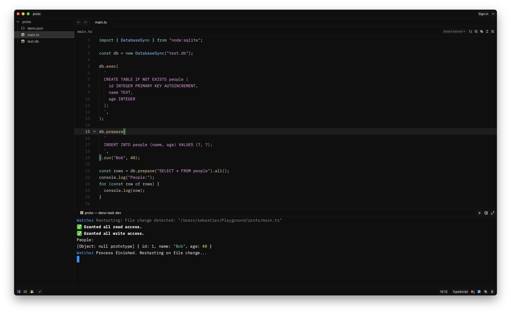

# Thunky Theme for Zed

A sophisticated dark theme for [Zed](https://zed.dev) that combines the elegant aesthetics of Evil Rabbit with the optimized syntax highlighting of JetBrains Fleet Dark.

## Preview




## Features

- **Perfect Fusion**: Carefully combines the UI elements of Evil Rabbit with the code syntax highlighting of Fleet Dark
- **Enhanced Readability**: Optimized color contrasts for comfortable long coding sessions
- **UI Consistency**: Harmonized editor components and interface elements

## Customization

Want to fine-tune the theme to your preferences? You can override settings in your `settings.json`:

```json
{
  "experimental.theme_overrides": {
    "editor.background": "#333",
    "syntax": {
      "comment": {
        "font_style": "italic"
      },
      "comment.doc": {
        "font_style": "italic"
      }
    }
  }
}
```

Learn more: https://zed.dev/docs/themes#theme-overrides

## Contributing

Contributions are welcome and appreciated! Here's how you can help:

1. **Report Issues**: If you find any inconsistencies or problems, please [open an issue](https://github.com/bastianplsfix/evil-fleet/issues)
2. **Suggest Improvements**: Have ideas for making the theme better? Share them in the issues section
3. **Submit PRs**: Feel free to fork the repository and submit pull requests with enhancements


## Credits

- Based on the wonderful [Evil Rabbit](https://github.com/kettanaito/zed-theme-evil-rabbit) theme
- Syntax highlighting inspired by [JetBrains Fleet](https://www.jetbrains.com/fleet/) Dark theme

## License

This theme is released under the [MIT License](LICENSE).
